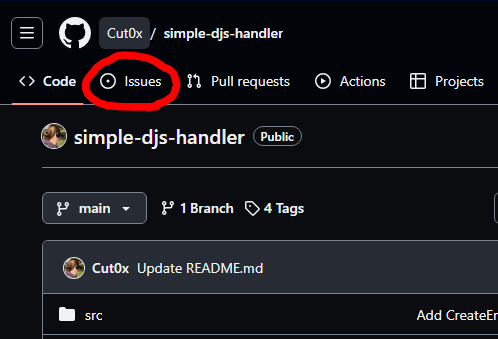
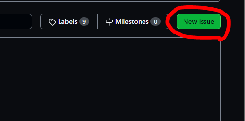
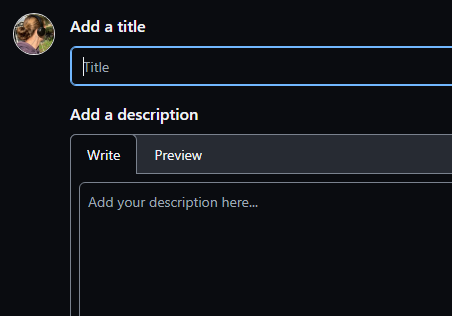
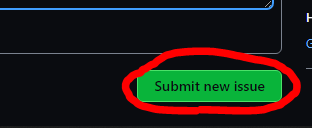
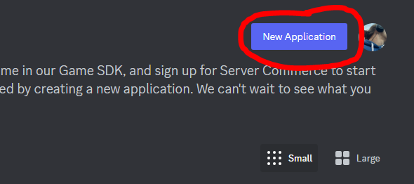
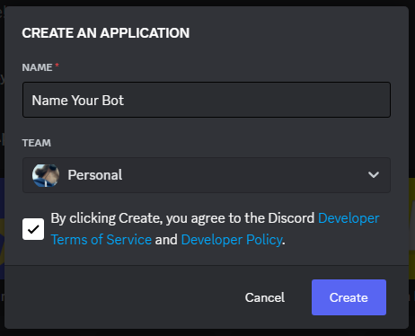
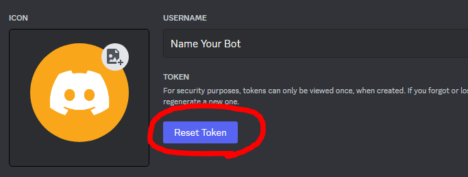
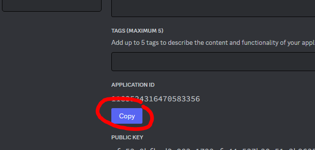

# :diamond_shape_with_a_dot_inside: Simple Discord.js Handler

### :question: Summary
<ul>
<li><a href="?tab=readme-ov-file#what-is-simple-djs-handler-">:hotsprings: What is `simple-djs-handler` ?</a></li>
<li><a href="?tab=readme-ov-file#credits">:hotsprings: Credits</a></li>
<li><a href="?tab=readme-ov-file#how-to-contribute-">:hotsprings: How to contribute ?</a>
<ul>
<li><a href="?tab=readme-ov-file#create-new-issues">:large_blue_circle: New issues</a></li>
<li><a href="?tab=readme-ov-file#on-discord">:large_blue_circle: On Discord</a></li>
<li><a href="?tab=readme-ov-file#on-twitter-𝕏">:large_blue_circle: On Twitter (&Xopf;)</a></li>
</ul></li>
<li><a href="">:hotsprings: Tutorial</a>
<ul>
<li><a href="">:large_blue_circle: Get Started</a></li>
<li><a href="">:large_blue_circle: Create Application</a></li>
</ul></li>
<li><a href="">:hotsprings: Free host</a>
<ul>
<li><a href="">:large_blue_circle: Get Started</a></li>
</ul></li>

# :diamond_shape_with_a_dot_inside: What is `simple-djs-handler` ?

This module allows you to simplify the structure of your Discord bot while keeping the code clean and readable. It is entirely coded in JavaScript with NodeJs. To use this module you need to know the basics of JavaScript and Discord.js.
You will find everything that is useful to use the discord.js module as little as possible, the module being constantly improved, it will be easy for you to improve your bots!

What's incredible is that you too can participate in improving the module!
To find out more, head to the <a href="https://github.com/Cut0x/simple-djs-handler/issues/new">How to contribute</a> category.

# :diamond_shape_with_a_dot_inside: Credits

[](https://git.io/awesome-stats-card)

# :diamond_shape_with_a_dot_inside: How to contribute ?

### :question: Create new issues
You can <a href="">create a new issue</a> to share your idea which may no doubt be added in the future.
   

### :question: On Discord
You can <a href="https://discord.gg/aTX6FP37pK ">join my discord server</a>, go to the "programmation" forum room and create a new post with the tag `simple-djs-handl`.

### :question: On Twitter (&Xopf;)
You can also contact me by private message <a href="https://twitter.com/cut0x_">directly on Twitter</a>!

# :diamond_shape_with_a_dot_inside: Tutorial

### :question: Get Started
To get started, you need to install <a href="">NodeJs</a> <i>(the recommended version)</i> so that everything works during testing. As for the code editor, by preference, I recommend <a href="">Visual Studio Code</a> <i>(configurable as you wish)</i>.

### :question: Create Application
Visit the <a href="https://discord.com/developers/applications">Discord Developer Portal</a> to create your app.



And there you have it, you have created a Discord application! Leave the window open, for the rest, we will need the page.

### :question: Installation
To configure the module to 70%, you just need to install it with npm <i>(hence the usefulness of NodeJs)</i>.
```bash
npm install simple-djs-handler
```

### :question: Configure the bot
You must initialize your main file <i>(which we will call `main.js`)</i> with this code:
```js
const { BotClient } = require('simple-djs-handler');
const { GatewayIntentBits } = require('discord.js');

const client = new BotClient({
  token: 'YOUR_BOT_TOKEN',
  slashCommandsEnabled: true, // true required for the module to function properly!
  slashCommandsClientId: 'YOUR_CLIENT_ID',
  intents: [
    GatewayIntentBits.Guilds,
    GatewayIntentBits.GuildMembers,
    GatewayIntentBits.GuildMessages,
    // ... add other intents as needed
  ],
});

client.start();
```
In the `YOUR_BOT_TOKEN` section, go to the **Bot** category on **Discord Developer Portal** and click on the button circled in red in the attached image.

For `YOUR_CLIENT_ID`, return to the **General Information** page and enter your bot's ID using this button circled in red in the attached image.

Once all this is done, you can now do
```bash
node main
```
To launch the bot, the module will create the `commands` and `events` folder.

### :question: Events config
I'm going to make you the `Ready.js` file which you need to make in the `./events/` folder which leads to `./events/Ready.js`.
```js
const { BotEvent } = require('simple-djs-handler');
const { Events } = require('discord.js');

module.exports = new BotEvent({
    name: Events.ClientReady,
    once: true, // This allows the code to be executed only once, for other event files, do not put `once: true`
    execute(client) {        
      client.user.setActivity('Visual Studio Code')
    },
});
```
To create the slashcommands, I will also create the `InteractionCreate.js` file which will therefore be in the direction `./events/InteractionCreate.js`.
```js
const { BotEvent } = require('simple-djs-handler');
const { Events } = require('discord.js');

module.exports = new BotEvent({
    name: Events.InteractionCreate,
    async execute(interaction) {
        if (!interaction.isChatInputCommand()) return;

        const command = interaction.client.commands.get(interaction.commandName);

        const client = interaction.client;

        if (!command) {
            console.log(`No order match ${interaction.commandName} was found.`)
            return;
        }

        try {
            await command.execute(client, interaction);
        } catch (error) {
            console.log(`Erreur lors du lancement d'une commande : ${error}`);
        }
    },
});
```

### :question: Commands config
Here is the command structure with all the possibilities
```js
// Command without option

const { BotCommand } = require('simple-djs-handler');

module.exports = new BotCommand({
    name: 'simple',
    description: 'An simple example command without options',
    execute: async (client, interaction) => {
        interaction.reply({
            content: "it's a simple command !"
        })
    },
});
```
```js
// Command with option

const BotCommand = require('../path/to/BotCommand');

module.exports = new BotCommand({
    name: 'example',
    description: 'An example command with options',
    options: [
        // Add your custom options for SlashCommandBuilder here
        {
            name: 'example_option',
            description: 'An example option',
            type: 'STRING', // All options in the table below
            required: true, // false if it's not required
        },
        // ... other options
    ],
    execute: async (interaction) => {
        const stringOption = interaction.options.getString('exemple_option');
        // Your order logic here (see simple command example)
    },
});
```

### :question: All options
| Option  | Correspond |
| ------------- | ------------- |
| `STRING`  | `getStringOption()`  |
| `USER`  | `addUserOption()`  |
| `CHANNEL`  | `addChannelOption()`  |
| `ROLE`  | `addRoleOption()`  |
| `SUBCOMMAND`  | `addSubcommand()`  |
| `SUB_COMMAND_GROUP`  | `addSubcommandGroup()`  |

# Features
- `BotClient({ options })` -> Main class for your Discord bot, extended from Discord.js Client.
- `BotEvent({ options })` -> A class to handle Discord events in a simplified way.
- `BotCommand({ options })` -> A class to handle Discord slash commands in a simplified way.

# Need help ?
Join my discord server [(click here !)](https://discord.gg/aTX6FP37pK) or contact me on twitter [(Click here !)](https://twitter.com/cut0x_) !